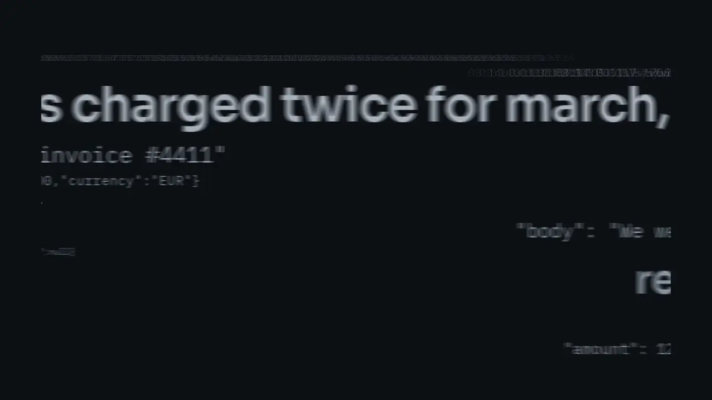
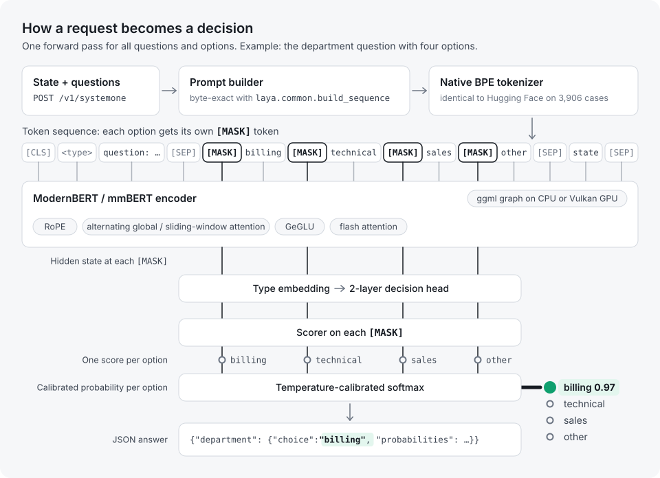
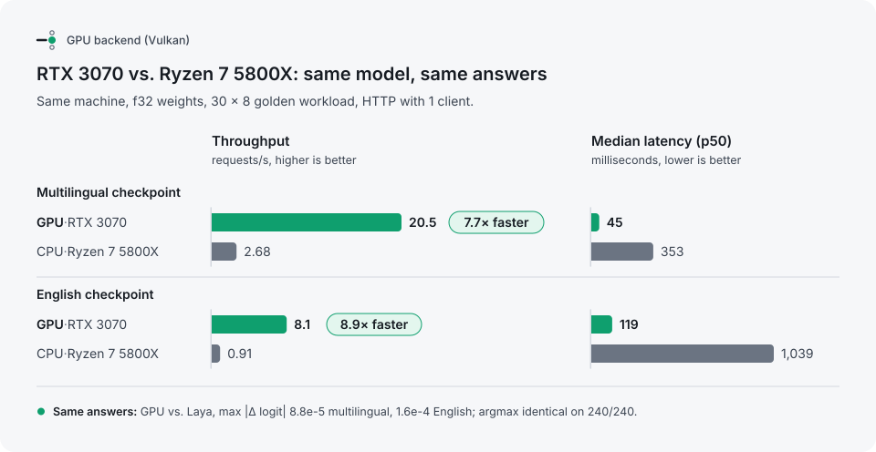
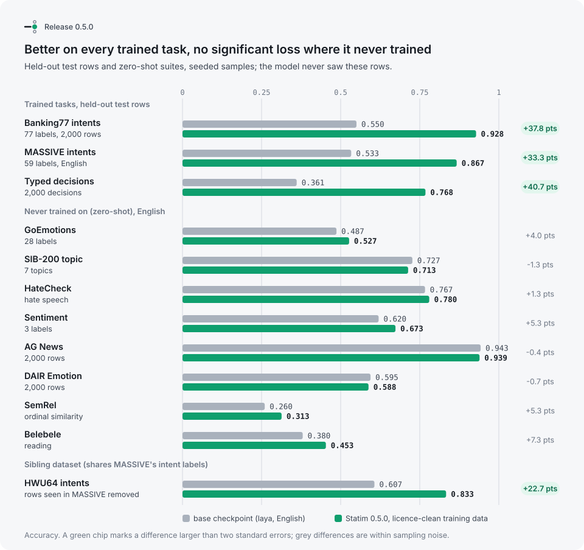
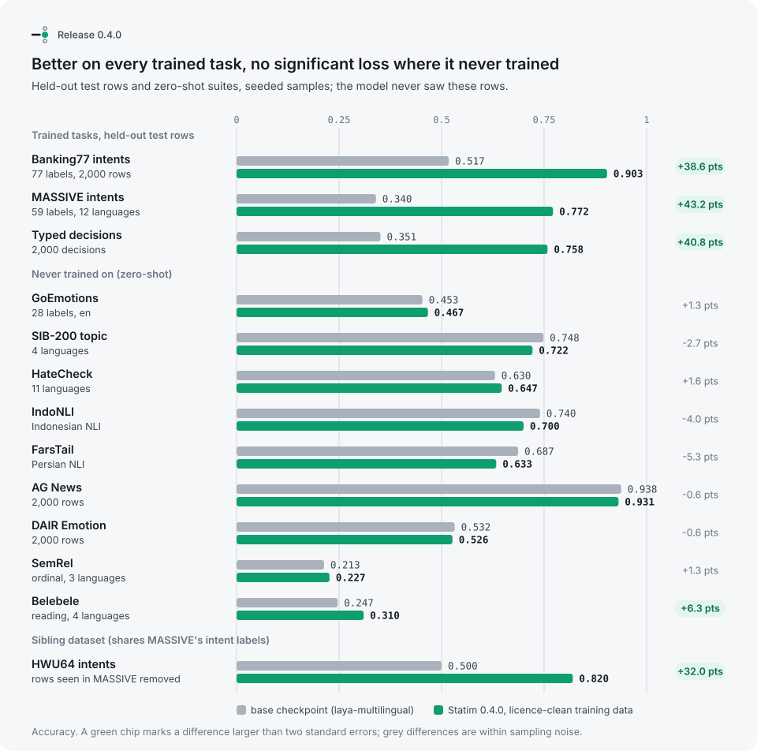
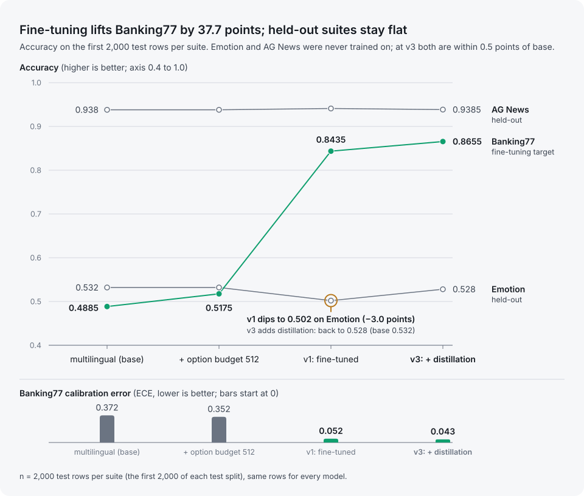

<h1 align="center">
  <picture>
    <source media="(prefers-color-scheme: dark)" srcset="assets/brand/logo-dark.svg">
    
  </picture>
</h1>

<p align="center">
  <a href="https://github.com/BEKO2210/statim/actions/workflows/ci.yml"></a>
  <a href="https://github.com/BEKO2210/statim/releases/latest"></a>
  <a href="LICENSE"></a>
  <a href="LICENSE-MODEL.md"></a>
</p>

<p align="center">
  <a href="https://beko2210.github.io/statim/#film">
    <picture>
      <source media="(max-width: 640px)" srcset="assets/readme/statim-intro-9x16.webp">
      
    </picture>
  </a>
  <br>
  <a href="https://beko2210.github.io/statim/#film"><b>Watch the 60-second film</b></a>
</p>

**A native C++20 engine for System-1 decision models.** Typed decisions — `choice`, `score`, `noul` —
over any text or JSON in a single forward pass, served from one static binary. No Python, no PyTorch,
no GPU required — and ~8× faster when there is one ([GPU](#gpu-vulkan-or-cuda)).

Statim runs the open [Laya](https://github.com/NandhaKishorM/laya) checkpoints (Apache-2.0) and speaks
the Jev/Laya `POST /v1/systemone` protocol, so existing clients switch by changing the base URL.

> *statim* (Latin): immediately, at once.

**Try it:** [live demo](https://huggingface.co/spaces/Beko2210/statim) (no install, no key) ·
**Models:** [statim-decide-en-large](https://huggingface.co/Beko2210/statim-decide-en-large) and
[statim-decide-multilingual-base](https://huggingface.co/Beko2210/statim-decide-multilingual-base) on
Hugging Face · **Example:** [ticket triage in ten minutes](examples/ticket-triage) ·
**Check the numbers yourself:** [REPRODUCE.md](REPRODUCE.md)

## Models

Statim runs any Laya checkpoint. The Statim Decide models are fine-tuned on licence-audited data and
pass the no-harm gate (below) before release:

| Model | Encoder | Languages | typed-decisions | Banking77 | MASSIVE | Files |
|---|---|---|---|---|---|---|
| [statim-decide-en-large](https://huggingface.co/Beko2210/statim-decide-en-large) 0.5.0 | ModernBERT-large, 395M | English | **0.768** | **0.928** | 0.867 (en) | f32 1.58 GB · q8_0 0.45 GB |
| [statim-decide-multilingual-base](https://huggingface.co/Beko2210/statim-decide-multilingual-base) 0.7.0 | mmBERT-base | 12 evaluated | 0.763 | 0.914 | 0.800 (12 languages) | f32 0.91 GB · q8_0 0.36 GB |

```bash
hf download Beko2210/statim-decide-en-large statim-decide-en-large-q8_0.gguf --local-dir models   # pip install huggingface_hub
./statim serve -m english=models/statim-decide-en-large-q8_0.gguf
```

For comparison under the same protocol: typed-decisions meraGPT 0.768, laya-typed-decisions 0.766,
Jev 0.727; Banking77 supervised MPNet 0.941. Weights are free for noncommercial use, for small
companies and for a 32-day trial; see [License](#license).

```bash
statim serve -m multilingual=laya-multilingual-f32.gguf --port 8080
curl -s localhost:8080/v1/systemone -d '{
  "state": {"subject": "Duplicate charge on invoice #4411",
            "body": "We were billed twice for March. Please refund the duplicate today or we will cancel."},
  "questions": {
    "department": {"type": "choice", "instructions": "Which department should handle this request?",
                   "criteria": {"billing": "invoices, payments, refunds", "technical": "bugs, outages",
                                "sales": "pricing, new contracts", "other": "everything else"}},
    "urgency":    {"type": "score", "instructions": "How urgent is this request?",
                   "criteria": ["not urgent", "soon", "critical deadline or blocking issue"]},
    "refund":     {"type": "noul", "instructions": "Does the user explicitly request a refund?"}}}'
```

## Why Statim

| | Laya (Python) | **Statim** |
|---|---|---|
| Runtime | Python 3.10+, PyTorch, transformers | one 3.3 MB binary + one `.gguf` file |
| Answers | reference | **identical** — 240/240 token sequences, answers within 1e-4 (CI-gated) |
| Tokenizer | HF `tokenizers` (Rust) | native C++, 100% identical on 3,906 cases + 140k fuzz strings, ~10× faster |
| Cold start → first answer | 11.35 s | **0.76 s** |
| Server memory | 3,915 MB | **650 MB** (mmap'd weights, shared between processes) |
| HTTP throughput | 0.43 req/s | **1.07 req/s** (2.5×) |
| Accuracy | one checkpoint per request | **consensus** of both checkpoints: equal on AG News, better on Emotion (+0.5 pt, NLL −8 %) and Banking77 (+6.25 pt), see [accuracy](#accuracy) |
| Server | FastAPI, one inference at a time | worker pool, admission control (503), bearer auth, Prometheus `/metrics`, JSON logs, `/health` + `/ready`, request IDs, graceful shutdown |
| Deploy | pip / Docker | static binary, distroless Docker, hardened systemd unit |

## How it works

<picture>
  <source media="(prefers-color-scheme: dark)" srcset="assets/diagrams/architecture-dark.svg">
  
</picture>

All three Laya checkpoints share this graph; the converter stores architecture, calibration and the
tokenizer in the GGUF file, so a model is a single self-describing artifact.

## Quick start

```bash
git clone --recursive https://github.com/BEKO2210/statim && cd statim
cmake -S . -B build -G Ninja -DCMAKE_BUILD_TYPE=Release && cmake --build build
pip install numpy safetensors gguf            # converter only; not needed at runtime
tools/fetch_models.sh multilingual english    # download from Hugging Face + convert to GGUF
ctest --test-dir build                        # parity gates against the official package (as a regular user, see REPRODUCE.md)
./build/statim serve -m english=models/laya-english-f32.gguf -m multilingual=models/laya-multilingual-f32.gguf --consensus
# open http://127.0.0.1:8080/ for the playground
```

Quantized variants: `build/statim-quantize models/laya-multilingual-f32.gguf out.gguf q8_0`.
See [accuracy](#accuracy) before choosing 4-bit.

## API

| endpoint | |
|---|---|
| `POST /v1/systemone` | `{state, questions, model?, lang?, min_confidence?}` → `{model, answers, usage, routing}` (Jev/Laya shape). `model`: `english`, `multilingual`, `consensus`, or omitted (auto-routing by language). `adapter`: a loaded LoRA adapter, `"auto"` (by question family) or `null`. Extras: `return_logits`, `calibrate`, `ensemble`; a positive `min_confidence` adds `escalate` to each answer |
| `POST /v1/systemone/batch` | `{states: [...], questions, ...}` → `{results: [...]}` packed into shared forward passes |
| `GET /v1/models` | loaded models |
| `GET /health`, `GET /ready` | liveness / readiness |
| `GET /metrics` | Prometheus: request counts by status, latency histogram, tokens, in-flight, busy workers |

### LoRA adapters

One base model can serve small per-category LoRA adapters, chosen per request:

```sh
python tools/convert_lora.py runs/emotion-lora -o models/emotion.lora.gguf \
    --base models/laya-multilingual-q8_0.gguf --category emotion      # PEFT adapter -> GGUF
statim serve -m multilingual=models/laya-multilingual-q8_0.gguf \
    --adapter multilingual:emotion=models/emotion.lora.gguf
curl -s localhost:8080/v1/systemone -d '{"state": "...", "adapter": "emotion", "questions": {...}}'
```

The converter takes LoRA on the encoder's attention and MLP projections and rejects anything it
cannot represent (DoRA, head or embedding LoRA, `modules_to_save`). By default adapters are merged
into a copy of the adapted weights at load (`W + B·A`, computed with ggml), so a request costs
exactly the base latency; each adapter then holds its own copy of those weights (116 MB for the
multilingual model at q8_0). `--adapter-mode runtime` keeps only the LoRA factors (a few MB) and
evaluates `B·(A·x)` in the graph, at 17-28 % more latency on CPU. `"adapter": "auto"` picks the
adapter whose category matches every question's family (keywords in the question ID, then the
instructions). Details, measurements and the exact rule: [docs/API.md](docs/API.md#lora-adapters).

Errors retain FastAPI's `{"detail": "..."}` shape: 400 malformed input, 401 auth,
413 resource limits, 422 invalid questions/budgets or an expired inference deadline,
and 503 admission/engine queue saturation. Successful Jev/Laya response shapes are unchanged.

Auth: set `STATIM_API_KEY=key1,key2` or pass `--api-key-file FILE` (one key per line;
blank lines and lines beginning with `#`, after trimming whitespace, are ignored).
Keys are compared in constant time. Each explicitly configured source must independently
provide at least one valid key; missing/unreadable/empty/comment-only files and empty
or invalid environment values abort startup, even if another source provides a key.
Keys contain 1–4096 printable ASCII bytes without whitespace. With **no key source
configured**, local unauthenticated use remains the default; startup logs explicitly
include `"auth":false,"auth_status":"off"`.

Bearer auth covers inference, `/metrics`, and `/v1/models`. `/health` and `/ready`
remain open for orchestrators; `/health` returns only `status` and `version`.
The playground at `/` remains public. Request IDs accept 1–128 ASCII letters,
digits, `.`, `_`, and `-`; other supplied IDs are replaced. Logs are serialized JSON.

Resource limits apply before ordered JSON DOM construction or inference. Unknown
request and question-definition fields and duplicate JSON keys are rejected; arbitrary
state object fields remain supported. Limits count UTF-8 **bytes** unless stated otherwise.

| Limit / server flag | Default | Meaning |
|---|---:|---|
| Request body | 2 MiB | Both length-framed and chunked bodies; oversized declared lengths are rejected without reading/draining the body |
| `--max-json-depth` | 64 | Nested objects/arrays including the root; configurable up to a hard ceiling of 128 |
| `--max-json-nodes` | 100,000 | Containers, scalar values, and object keys in the entire request |
| `--max-object-members` | 1,024 | Members per object, checked before ordered-map insertion |
| JSON object key | 4,096 bytes | Applies also to arbitrary state objects |
| States / questions | 256 / 64 | Per batch / per request |
| State size | 50,000 Unicode codepoints | Per state, using its Python-compatible serialization for structured states |
| Choice / score / total options | 100 / 32 / 512 | Per question / per question / across questions |
| Question ID / model / language | 256 bytes each | Bounds names and routing fields |
| Instructions | 16,384 bytes | Per question; rendered JSON length for structured instructions |
| Criterion / label value | 4,096 bytes | Per value, including structured score legends; object label keys: 1,024 bytes |
| `max_len`, `head_max_len` / `--max-len`, `--head-max-len` | Checkpoint defaults | Explicit nonzero budgets: integers 32–8,192, checked before narrowing. Effective length is `max(max_len, head_max_len + 128)` and must fit model capacity. CLI `0` selects checkpoint defaults |
| `ensemble` / `--ensemble` | 1 | Integer 1–8 |
| `min_confidence` / `--min-confidence` | unset | Number 0–1; answers below a positive threshold get `escalate: true` |
| `--max-request-work` | 4,096 | State × question × view evaluations, including consensus models and three calibration views on every potential cache miss |
| `--max-request-tokens` | 1,048,576 | Conservative total: evaluated rows × effective sequence budget, including ensembles/calibration/consensus |
| `--max-attention-mib` | 1,024 MiB | Conservative per-graph estimate: `2 × min(32 × length, 8192) × length × max(encoder_heads, head_heads) × 4` bytes, covering all shorter packed rows too |
| `--max-response-bytes` | 16,777,216 | Conservative response estimate before inference, plus a final serialized-response check |
| `--max-concurrent` | 16 | Admitted inference requests including body reception and engine queueing; excess gets 503; configurable 1–256 |
| `--workers` | 1 | Inference workers per model; configurable 1–64. A model's LoRA adapters share its workers |
| `--batch-window-ms` | 0 | Wait this many milliseconds to combine compatible concurrent `/v1/systemone` requests; 0 disables micro-batching |
| `--max-batch` | 16 | Maximum states in one server-created micro-batch; configurable 1–256 |
| `--http-queue` | 32 | Pending sockets, in addition to `max-concurrent + 4` fixed HTTP workers; excess sockets are closed |
| `--request-timeout` | 30 seconds | Absolute combined header/body read deadline; periodic bytes do not extend it |
| Keep-alive / write timeout | 2 seconds idle, 100 requests / 30 seconds | Bounds idle connections and individual blocked writes |
| `--inference-timeout` | 120 seconds | From admission, including body reception and engine queue wait; cooperative CPU cancellation between ggml operations, GPU checks between bounded graphs |
| Calibration cache | 4 MiB and 4,096 entries per engine | LRU, with retained key/value bytes and bookkeeping charged; oversized entries are computed but not retained |

Aggregate budgets deliberately use upper bounds, so short tokenized text can still be
rejected when its requested sequence budget is large. Long-context workloads can raise
the token/attention limits explicitly; these are estimates, not a process memory ceiling.
Response estimates reserve 1,024 bytes/state plus 4,096 bytes/question and eight times
the serialized question and ID sizes. Bounded token buffers retain the existing graph
sorting and packing order to preserve inference results. Calibration keys include only
rendered question inputs, content-free state shape, and effective budgets. They use exact
bounded strings rather than lossy hashes, preserving cache correctness.

The systemd example requires `/etc/statim/env` and a nonempty `STATIM_API_KEY`; it sets
`MemoryHigh=6G`, `MemoryMax=8G`, `CPUQuota=400%`, `TasksMax=256`, and `LimitNOFILE=4096`.
Tune these for the loaded models/workers. Container deployments should likewise supply
memory/CPU limits and a TLS-terminating proxy. Application deadlines are cooperative;
a running compute operation must finish before cancellation takes effect.
See the [production deployment guide](docs/DEPLOY.md) for hardened systemd, CPU/Vulkan Docker,
TLS reverse proxy, probe, metrics, and resource-ceiling examples.

Security regressions run through `ctest`, including socket-free HTTP parser/middleware
checks and live HTTP attacks using the CPU multilingual model. Run the latter directly:

```sh
python3 tests/security/test_http.py --binary build/statim --model models/laya-multilingual-f32.gguf
```

The [security coverage report](tests/security/REPORT.md) maps each finding to its fix and regression.
The script tries localhost port 8094, then a free port. Environments that forbid binding
report a CTest skip (exit 77); run this command manually in a socket-capable environment.

## Client SDKs

Official clients live in `clients/`. Both speak the HTTP API above, ship with no runtime
dependencies beyond the language standard library, and retry `503` with backoff.

| Package | Path |
|---|---|
| Python `statim` | [`clients/python`](clients/python) (`pip install ./clients/python`) |
| TypeScript `@statim/client` | [`clients/js`](clients/js) (`npx tsc`, then import the package) |

```python
from statim import Client

client = Client("http://127.0.0.1:8080", timeout=120)
decision = client.decide(
    {"subject": "Duplicate charge on invoice #4411"},
    {"refund": {"type": "noul", "instructions": "Does the user explicitly request a refund?"}},
    model="multilingual",
)
print(decision.answers["refund"].noul, decision.answers["refund"].confidence)
```

`decide`, `decide_batch`, `models`, `health`, and `ready` are the same methods in both
languages. Yes/no questions use wire type `noul` and come back as `YesNoAnswer`.
Examples, errors, and request IDs: [`clients/python/README.md`](clients/python/README.md),
[`clients/js/README.md`](clients/js/README.md).

## Benchmarks

Measured on a 2015-class laptop CPU (Intel Xeon E3-1505M v5, 4 cores / 8 threads, AVX2, turbo off,
31 GB RAM), `laya-multilingual` checkpoint, f32, Laya 0.3.20 on PyTorch 2.14. Workload: the 30 states
× 8 questions in `tests/data/golden_inputs.json` (choice, score and noul, up to 20 options, up to 770
tokens). Each engine at its best thread count. Scripts in `bench/`.

| | Laya (Python) | **Statim** | |
|---|---|---|---|
| Latency in-process, mean / p50 per state | 1,186 / 815 ms | **1,139 / 823 ms** | on par (−4 % mean) |
| HTTP, 1 client: throughput | 0.43 req/s (`laya-serve`, 4 threads) | **1.07 req/s** (6 threads) · 0.99 req/s (4 threads) | **2.3–2.5×** |
| HTTP, 1 client: p50 / p95 | 1,718 / 4,994 ms | **889 / 1,280 ms** | p95 **−74 %** |
| HTTP, 4 clients: throughput / p95 | 0.53 req/s / 11,958 ms | **1.12 req/s / 4,425 ms** | **2.1×** |
| Server resident memory | 3,915 MB | **650 MB** | **6× less** |
| Cold start → first answer | 11.35 s | **0.76 s** | **15× faster** |
| Peak memory, one-shot | 2,667 MB | **585 MB** (f32) · **234 MB** (q8_0) | **4.6–11× less** |
| Runtime footprint | PyTorch alone ≥ 1.2 GB | **3.3 MB** binary | |

Raw FLOPs are the same model either way, and PyTorch's fp32 GEMM (MKL/oneDNN) is already close to this
CPU's peak, so single-request latency is at parity. The gains come from everything around the forward
pass: no interpreter, no framework start-up, mmap'd weights (untouched embedding rows never enter
RAM), rows of many states packed into shared graphs, a worker pool instead of one global inference
lock, flash attention, a fused GeGLU kernel and an exact pruning of the last head layer to the rows
the scorer reads.

`q8_0` halves the file and cuts memory 2.5×, but on AVX2 without VNNI it is slower than f32 and moves
logits by up to ~0.4 (2 of 240 parity answers change); ARM (dotprod/i8mm) and AVX-512-VNNI CPUs are
where int8 pays off. 4-bit is not recommended for this model family (see below).

## GPU (Vulkan or CUDA)

Optional, off by default. Vulkan needs the Vulkan headers, `glslc` and SPIR-V headers at build time
(Debian/Ubuntu: `libvulkan-dev glslc spirv-headers`) and a Vulkan driver at run time. CUDA needs the
CUDA toolkit (`-DSTATIM_CUDA=ON`); its `*_cuda` parity gates pass like the Vulkan ones.

```bash
cmake -S . -B build-vk -DSTATIM_VULKAN=ON && cmake --build build-vk
ctest --test-dir build-vk                      # CPU gates + the same gates on the GPU (*_vulkan)
./build-vk/statim serve --device vulkan -m english=models/laya-english-f32.gguf -m multilingual=models/laya-multilingual-f32.gguf
```

`--device` takes `cpu` (default), `gpu`, `vulkan`, `cuda` or a device name such as `Vulkan0`
(`STATIM_DEVICE` sets the default). Weights are copied to VRAM once; both f32 checkpoints use ~3.3 GB.

With the usual single GPU worker, enable server-side micro-batching to turn concurrent single-state
calls into packed forward passes:

```bash
./build-vk/statim serve --device vulkan -m english=models/laya-english-f32.gguf \
  --batch-window-ms 2 --max-batch 16
```

Each admitted `POST /v1/systemone` waits at most 2 ms for compatible peers. Requests must resolve to
the same model and use the same validated questions and effective inference options; other requests
form separate groups. Every client still receives the ordinary single-state response with its own
request ID, routing and usage. Packing uses the existing `/v1/systemone/batch` execution path and
produces the same answers as running each request alone (probabilities within the 1e-4 parity gate).
The default window is 0, so latency and scheduling are unchanged unless this is enabled.

Measured with the English model on an RTX 3070 (Vulkan, exact f32, the long golden workload of up
to 770 tokens and 8 questions per request): 8.47 → 8.30 req/s with one client (−2 %), 8.50 → 9.64
with 8 concurrent clients (+13 %), 8.48 → 10.78 with 16 (+27 %). Each long request already keeps the
GPU busy, so the gain grows with concurrency and should be larger for short requests. On a CPU it
does not help (the cores are already saturated); leave it off there.

Which backend: measured on an RTX 3070 and a Ryzen 7 5800X with the English large model (HTTP,
one client, 60 requests; `bench/bench_server.py`):

| | CPU | Vulkan | CUDA |
|---|---|---|---|
| f32, exact (default) | 0.84 req/s | 8.40 req/s | 8.35 req/s |
| f32, `--gpu-fast` (f16 math) | | **16.4 req/s** | 11.7 req/s |
| q8_0 weights | | 9.0 req/s | **15.7 req/s** |

Exact f32 runs equally fast on both backends (the multilingual model: Vulkan 21.9, CUDA 16.2 req/s),
so Vulkan stays the default. On NVIDIA cards, q8_0 on CUDA is the fastest way to serve the large
model while keeping f32 activations; q8_0 and `--gpu-fast` both move logits slightly.

<picture>
  <source media="(prefers-color-scheme: dark)" srcset="assets/diagrams/gpu-dark.svg">
  
</picture>

Measured on an RTX 3070 (8 GB) vs. the same machine's Ryzen 7 5800X (16 threads), f32, the 30 × 8
golden workload:

| | CPU | **RTX 3070** | |
|---|---|---|---|
| multilingual, in-process per state | 535 ms | **54 ms** | **~10×** |
| english, in-process per state | 1,683 ms | **137 ms** | **~12×** |
| multilingual, HTTP 1 client | 2.68 req/s · p50 353 ms | **20.5 req/s · p50 45 ms** | **7.7×** |
| english, HTTP 1 client | 0.91 req/s · p50 1,039 ms | **8.1 req/s · p50 119 ms** | **8.9×** |
| parity vs. Laya, max \|Δlogit\| (multilingual / english) | 5.0e-4 / 2.0e-4 | **8.8e-5 / 1.6e-4** | 240/240 argmax |

**Exact by default.** ggml's Vulkan backend normally feeds f32 matmuls through f16 (cooperative
matrices / fp16 shaders), which moves logits by up to ~0.12 on long inputs. Statim disables those paths
unless asked, and always uses the flash-attention kernel on GPUs (the explicit softmax path converts
non-contiguous operands to f16). `--gpu-fast` (or `STATIM_GPU_FAST=1`) turns f16 back on: 24.5 ms per
state instead of 54, argmax still 240/240, but logits within ~1e-1 rather than 1e-4.

## Accuracy

Same construction as Laya's own Jev comparison (`research/scripts/bench_apps.py`): first 400 test
rows, identical prompts, CPU, fp32. Reproduce with `bench/eval_accuracy.py`.

| suite (400 cases) | Jev (published)¹ | Laya `laya` (English)² | Laya `laya-multilingual`² | **Statim consensus** |
|---|---|---|---|---|
| AG News (4 labels) | 0.910 | 0.950 | 0.935 | **0.950** |
| DAIR Emotion (6 labels) | 0.480 | 0.5925 | 0.5375 | **0.600** |
| Banking77 (all 77 labels at once) | 0.870 (72 labels) | 0.425 | 0.470 | **0.4875** |

| Emotion calibration | NLL | ECE | Brier |
|---|---|---|---|
| Laya `laya` | 2.019 | 0.306 | 0.696 |
| **Statim consensus** | **1.865** | **0.286** | **0.686** |

¹ Third-party published numbers, as quoted by Laya; different samples and prompts, indicative only.
² Measured through Statim's exact mode, which is bit-identical to the Laya package (CI-gated), so these
  are Laya's numbers. Laya reports 0.953 / 0.600 for the English checkpoint on its own run.

**Consensus** (`"model": "consensus"`, or `statim serve --consensus`) runs the English (ModernBERT-large)
and multilingual (mmBERT) checkpoints on the same request and averages their option log-probabilities.
Laya's router always answers with one checkpoint. Measured cost: 1.25–1.4× the English checkpoint alone.

What did **not** help, measured and kept out of the defaults:
- **Option-order ensembling** (cyclic rotations of the options): Emotion 0.5375 → 0.525. The checkpoint
  was trained on a fixed option order; permutations are out of distribution. Still available as
  `ensemble: K` (choice questions only; score levels are ordinal and never rotated).
- **Contextual calibration** (`calibrate: true`, Zhao et al. 2021): +2.0 points on Emotion for the
  multilingual checkpoint, neutral to slightly negative elsewhere; improves ECE on Banking77. Opt-in.
- **4-bit weights** (`q4_0`, `q4_K`): flip 1–2 of 16 parity answers. f32 is the reference; `q8_0`
  halves memory with small logit drift (see benchmarks).

## Results

### 0.5.0: statim-decide-en-large

<picture>
  <source media="(prefers-color-scheme: dark)" srcset="assets/diagrams/results-0.5.0-dark.svg">
  
</picture>

The English checkpoint (ModernBERT-large) fine-tuned with the same licence-clean recipe; 8-bit AdamW
fits it on an 8 GB GPU. Against its base on 54 held-out suites: 11 significant gains, 0 regressions,
and the suites it never trained on stay within noise. typed-decisions 0.768 equals the best
published result (meraGPT 0.768). Reproduce:

```bash
.venv-train/bin/python tools/finetune/train_multitask.py models/laya models/laya-english-big1 --clean \
    --mixture data/mixture-v5.jsonl.gz --massive-langs en --massive-per-lang 11000 --max-len 1024 \
    --epochs 12 --patience 3 --distill 12000 --budget banking77=12000,massive=8000,mixture=20000,typed=4000,distill=6000 \
    --warmup 0.06 --ema 0 --optim adamw8bit --max-tokens 3072 --accum 6
.venv-train/bin/python tools/finetune/gate.py eval models/laya-english-big1
.venv-train/bin/python tools/finetune/gate.py compare models/laya models/laya-english-big1
```

### 0.4.0: statim-decide-multilingual-base

<picture>
  <source media="(prefers-color-scheme: dark)" srcset="assets/diagrams/results-0.4.0-dark.svg">
  
</picture>

The 0.7.0 model is the multilingual checkpoint fine-tuned on **licence-audited data only**
(`train_multitask.py --clean`; every source in [DATA_LICENSES.md](DATA_LICENSES.md)). typed-decisions
0.763 is above Jev (0.727) and the dataset's teacher agreement ceiling (0.735). Since 0.7.0 it also
answers 14 decision categories (mixture v6, 111 licence-checked sources): on held-out category suites
it reaches 0.748 macro accuracy, up from 0.559 for 0.4.0 (per category in the model card). A new model replaces
the current one only through `tools/finetune/gate.py`: its validation mean must improve, no held-out
suite may drop by more than two standard errors, and no suite family (trained, zero-shot, sentiment)
may drift down significantly when pooled. Training uses early stopping on validation. Reproduce:

```bash
.venv-train/bin/python tools/finetune/build_mixture.py --out data/mixture-v4.jsonl.gz --per-source 2000 --audit tools/finetune/licence_audit.json
.venv-train/bin/python tools/finetune/build_extra.py --out data/extra-v1.jsonl.gz   # then merge v4 + extra into data/mixture-v5.jsonl.gz
.venv-train/bin/python tools/finetune/train_multitask.py models/laya-multilingual models/laya-multilingual-big1 --clean \
    --mixture data/mixture-v5.jsonl.gz --massive-per-lang 2000 --epochs 20 --patience 3 \
    --budget banking77=12000,massive=16000,mixture=20000,typed=4000,distill=3000 --warmup 0.06 --ema 0.999
.venv-train/bin/python tools/finetune/gate.py eval models/laya-multilingual-big1
.venv-train/bin/python tools/finetune/gate.py compare models/laya-multilingual-clean models/laya-multilingual-big1
```

## Many options and fine-tuning (Banking77)

**Option budget.** Laya fits all options into `head_max_len` tokens (192 English, 256 multilingual)
and, when they do not fit, cuts every option to `(head_max_len - 16) / k` tokens. With Banking77's 77
intents that is one or two subwords per intent: the model never reads the label names. Raising the
budget per request (`"head_max_len": 512`, same parameter as Laya's `predict_batch`; server default
`--head-max-len`) needs no training. It changes nothing for questions whose options already fit, and
`max_len` grows with it so the state keeps at least 128 tokens.

**Fine-tuning.** `tools/finetune/train_banking77.py` applies Laya's own RLCD recipe (from its
fine-tuning notebook) to the multilingual checkpoint: Banking77 *train* (option order shuffled per
item), replay of `LocalLLaMA/typed-decisions` train, token embeddings frozen (90 % of mmBERT's
parameters; weight decay would otherwise erode every language Banking77 never touches), best epoch by
held-out dev, temperatures refit on held-out items. `--distill N` adds learning-without-forgetting
replay: generic zero-shot questions over tweets and news (never the evaluation data) whose targets
are the *base* model's own answer distributions, so it anchors old behaviour without teaching any
label. 5 epochs, 35 minutes on an RTX 3070.

```bash
python -m venv .venv-train && .venv-train/bin/pip install torch laya==0.3.20 datasets
.venv-train/bin/python tools/finetune/train_banking77.py models/laya-multilingual models/laya-multilingual-banking77 --distill 6000 --epochs 5
.venv/bin/python tools/convert_laya.py models/laya-multilingual-banking77 -o models/laya-multilingual-banking77-f32.gguf --type f32 --embd-type f16
.venv-train/bin/python tools/finetune/eval_laya.py models/laya-multilingual-banking77 --n 2000 --head-max-len 512
```

<picture>
  <source media="(prefers-color-scheme: dark)" srcset="assets/diagrams/finetune-dark.svg">
  
</picture>

First 2,000 test rows per suite (never trained on; ±1.1 pt standard error around 0.5), plus the
2,000 decisions of the `typed-decisions` test split:

| | multilingual | + `head_max_len` 512 | v1: fine-tuned, 3 ep. | **v3: + distillation, 5 ep.** |
|---|---|---|---|---|
| Banking77 accuracy | 0.4885 | 0.5175 | 0.8435 | **0.8655** |
| Banking77 ECE | 0.372 | 0.352 | 0.052 | **0.043** |
| AG News (held out) | 0.938 | 0.938 | 0.941 | **0.9385** |
| Emotion (held out) | 0.532 | 0.532 | 0.502 | **0.528** |
| Emotion ECE | 0.336 | 0.336 | 0.210 | **0.155** |
| typed-decisions test | 0.351 | 0.351 | 0.6665¹ | **0.7015**¹ |

¹ In-domain: its train split is replay data. AG News and Emotion were never trained on.

Without distillation, Emotion lost 3 points (v1); with it, every held-out suite stays within noise of
the base model while Banking77 gains 35 points and all calibration errors shrink. Statim and the Laya
package agree on the fine-tuned checkpoint (Banking77, first 400: 0.8675 vs. 0.870, bf16 vs. f32).
The weights are not in this repository; the script reproduces them.

## Status

v0.5 — CPU backend (x86-64 AVX2, ARM NEON via ggml), optional Vulkan and CUDA GPU backends, two
published Statim Decide models, and a public demo. See [CHANGELOG.md](CHANGELOG.md) for releases and
[docs/ROADMAP.md](docs/ROADMAP.md) for the path to 1.0. Next: training on every decision category
(sentiment including mixed opinions, emotion, NLI, moderation, reading comprehension, similarity)
with licence-clean data, and better language routing. Language routing is a light heuristic today
(English text → English model, everything else → multilingual). Metal is on the roadmap.

## License

| | Licence |
|---|---|
| Source code (engine, server, tools) | [Apache-2.0](LICENSE), free for any use |
| Model weights published by Statim, noncommercial | [PolyForm Noncommercial 1.0.0](LICENSE-MODEL.md): free for personal use, research, experiments and noncommercial organisations |
| Model weights, small companies | [PolyForm Small Business 1.0.0](LICENSE-MODEL.md): free, including commercial use, below 100 people and 1 M USD revenue |
| Model weights, evaluation | [PolyForm Free Trial 1.0.0](LICENSE-MODEL.md): any company may evaluate them for fewer than 32 consecutive days |
| Any other commercial use of Statim weights | paid licence, see [COMMERCIAL.md](COMMERCIAL.md) |

Released weights are trained only on commercially usable, non-ShareAlike data; every source is listed
in [DATA_LICENSES.md](DATA_LICENSES.md). The original Laya checkpoints that Statim runs are Apache-2.0
by their authors. Statim is independent and not affiliated with the Laya authors or TypeSafe; see
[NOTICE](NOTICE).
